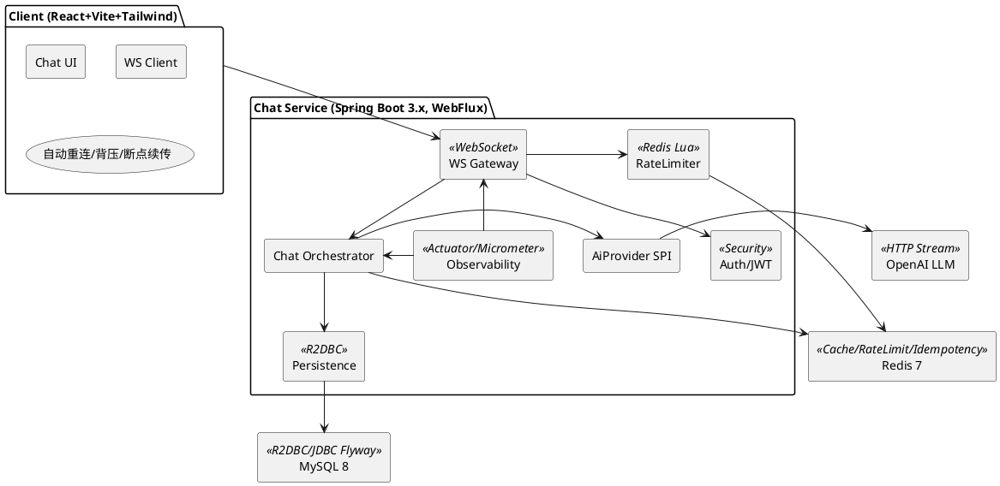
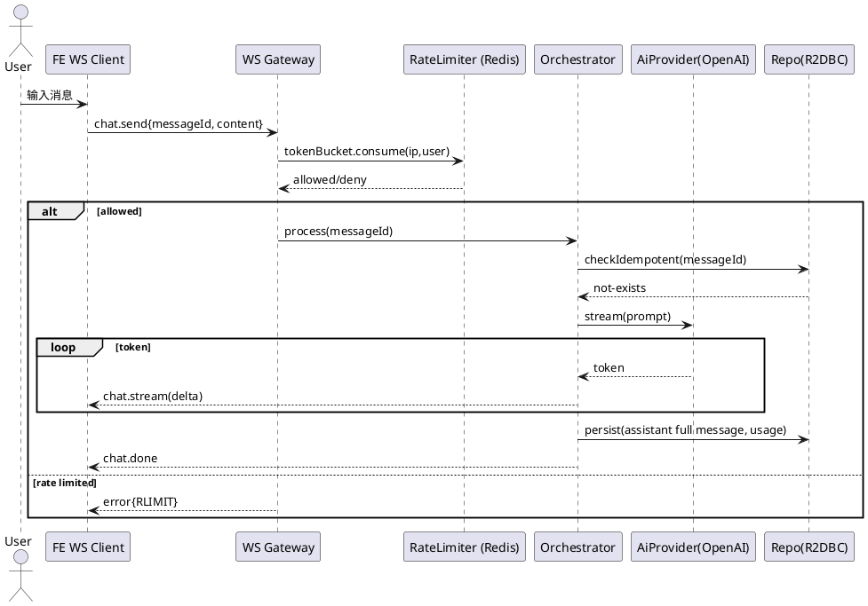
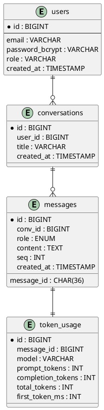

# SPEC-1-Spring Boot WebFlux WebSocket ChatBot

> Hunky Hsu

## Background

**Goal**
构建一个基于 Spring Boot WebFlux + WebSocket 的实时 ChatBot（MVP），配套 React + Tailwind + Vite 的 ChatGPT 风格前端，用以学习并沉淀一套贴近生产的“标准与规范”：分层/模块化设计、流式输出、对话历史落库、热点缓存与观测性。

**In Scope**

- 双向实时对话（WebSocket），消息按 token/片段流式输出到前端。
- 对话历史保存到 **MySQL（Spring Data R2DBC）**；热点会话与最近消息缓存到 **Redis**。
- 简单会话管理与基本限流；基本监控与日志规范。

**Out of Scope**

- 向量检索/长文档知识库、多机器人编排、复杂权限/多租户。
- 大规模分布式拆分与弹性伸缩自动化（保留扩展位）。

**Tech Stack**

- 后端：Spring Boot 3.x、WebFlux、WebSocket（JSON 协议）、Spring Data R2DBC、Redis、Flyway、Micrometer。
- 前端：React 18、Vite、Tailwind CSS，原生 WebSocket 客户端；UI 类 ChatGPT。

**Design Principles**

- 端到端响应式：避免阻塞，利用背压；读写分离与幂等保证。
- 可测试、可观察、可扩展：分层清晰，接口可替换，监控埋点齐全。

---

## Requirements

**MoSCoW 优先级**

### Must Have

- **FR-M1 WebSocket 实时双向通讯**：`/ws/chat` 路径；前端按 token/片段逐步渲染；服务器端支持背压、心跳（30s ping/pong）、超时与断线重连（幂等 `messageId`）。
- **FR-M2 对话可持久化**：实体含 *User、Conversation、Message、TokenUsage*；使用 **MySQL 8 + Spring Data R2DBC**；以 **Flyway** 管理迁移；写入采用异步流水线，消息落库可观测。
- **FR-M3 热点缓存与限流**：**Redis 7** 缓存最近 N 条消息（默认 20）与会话元数据；实现基于 Redis 的**令牌桶**限流（IP、用户双维度）。
- **FR-M4 认证与授权**：账号密码注册/登录（BCrypt）；**JWT**（访问令牌 + 刷新令牌），角色 `USER/ADMIN`；支持**游客模式**（匿名会话、限流更严）。
- **FR-M5 可插拔 LLM Provider**：定义 `AiProvider` 接口；默认实现 **OpenAI**（Responses/ChatCompletions 流式）；安全读取 `OPENAI_API_KEY`；可配置模型、系统提示。
- **FR-M6 观测性**：**Spring Boot Actuator + Micrometer/OTel**；结构化 JSON 日志；关键指标（WS 连接数、首令牌延迟、生成速率、错误率、限流命中）。
- **FR-M7 配置与工程规范**：分环境（dev/prod）、`application-*.yml`、统一异常与验证、CORS 策略；容器化（Dockerfile）与 **docker-compose**（MySQL、Redis、一体化启动）。
- **FR-M8 基本管理能力**：查询/软删除会话、导出单会话消息（JSON/NDJSON），仅 `ADMIN` 可跨用户查看。
- **FR-M9 前端 MVP**：React + Vite + Tailwind；ChatGPT 风格 UI（侧边会话列表、主聊天窗、设置面板）；消息**流式渲染**、滚动跟随；登录/注册/登出流程；可切换“游客模式”。

### Should Have

- **FR-S1 打字中/思考中指示**（基于服务端 token 流节奏）。
- **FR-S2 内容安全/敏感词过滤**（可接入 OpenAI Moderations 或本地词表，开关可控）。
- **FR-S3 失败重试与断点续传**（客户端携带 `lastMessageSeq` 恢复）。
- **FR-S4 审计日志**（谁、何时、做了什么，落盘/可检索）。
- **FR-S5 UI 多语言（i18n）**，默认中文/英文切换。

### Could Have

- **FR-C1 会话标题自动生成**（基于首条助手机器人消息）。
- **FR-C2 预设提示词与角色 Persona**（系统提示模板管理）。
- **FR-C3 导出 Markdown / 复制整段**。
- **FR-C4 Webhook（Slack/Teams）** 或简单外呼 API。

### Won’t Have for now

- 多租户/SSO、支付与配额结算、向量检索与长文档 RAG、复杂编排与多 Bot、中台级别运维门户。

### 非功能性需求

- **NFR-Perf**：单实例（2 vCPU/4GB）目标 *500* 并发 WS；首 token 延迟（p95）≤ *1.0s*（外部 LLM 视网络而定）；消息入库 p95 ≤ *50ms*。
- **NFR-Rel**：WS 空闲 *120s* 自动断开；优雅停机 *30s*；LLM 调用超时 *30s*；失败快速降级为提示性错误。
- **NFR-Sec**：密码 **BCrypt**（10 轮）；JWT 建议 **RS256**；最小权限原则；输入校验；审计开启；Secrets 走环境变量/外部密管。
- **NFR-Data**：默认保留 *30 天*，到期清理 Job；PII 最小化；GDPR 简化导出（按会话）。
- **NFR-Obs**：关键指标与健康检查暴露；日志保留/轮转；可接入外部 APM（如 Grafana/Tempo/Loki）。

> **验收要点（样例）**：
>
> - 新用户注册登录成功，获得 JWT，能创建会话并与 Bot 对话；
> - 发送一条消息后，前端在 1s 内开始流式渲染；
> - 刷新页面后可在会话中看到完整历史；
> - 限流触发时返回标准错误并在 60s 后恢复；
> - 管理员可查看并导出任意用户某会话记录。

## Method

> 目标：在不牺牲可读性的前提下，给出**可直接实现**的后端/前端架构、接口协议、数据模型与运行时流程。

### 1) 架构总览（组件与边界）



**说明**

- **WS Gateway**：唯一对外实时入口，处理握手、鉴权（JWT/游客）、心跳、背压、消息编解码。
- **Chat Orchestrator**：流程编排（限流→幂等→调用 LLM→流式回推→持久化→缓存）。
- **AiProvider SPI**：`AiProvider` 接口 + `OpenAiProvider` 实现（后续可新增 Azure/OpenRouter）。
- **Persistence**：R2DBC 非阻塞访问 MySQL；Flyway 负责建模/迁移（JDBC）。
- **Redis**：缓存热点会话、令牌桶限流、`messageId` 幂等。
- **Observability**：Actuator、Micrometer、结构化 JSON 日志、链路追踪埋点。

---

### 2) 前后端通信协议（WebSocket JSON Envelope）

**握手**：浏览器以 `Sec-WebSocket-Protocol` 传 JWT（或游客 `guest`），URL 形如：

```
wss://api.example.com/ws/chat?convId=123
Header: Sec-WebSocket-Protocol: jwt.<accessToken>
```

**消息封包（统一格式）**：

```json
{
  "type": "chat.send | chat.stream | chat.done | error | heartbeat",
  "conversationId": "123",
  "messageId": "be6a...", // 幂等ID（客户端生成UUID）
  "seq": 10,                // 会话内序号（服务器维护）
  "role": "USER|ASSISTANT|SYSTEM",
  "content": "文本或增量片段",
  "delta": true,            // 流式片段标记（仅 stream 时为 true）
  "ts": 1735257600123,      // 服务器毫秒时间戳
  "error": {"code":"RLIMIT","msg":"Rate limited"}
}
```

**基本流程**：

- 客户端发送 `chat.send`（带 `messageId` 与 `content`）。
- 服务器校验（JWT/游客 → 限流 → 幂等 → 负载/背压）。
- 调 OpenAI 流式接口，服务器按 token 逐条回发 `chat.stream`（`delta=true`）。
- 完成后发送 `chat.done`，同时将完整助手机器人消息持久化（含 TokenUsage）。

---

### 3) 关键时序（发送与断点续传）



**断点续传（简化）**：客户端重连时携带 `lastMessageSeq`，服务器从 Redis `conv:recent:<convId>` 回放缺失片段或直接返回最后完整消息。

---

### 4) 数据模型（MySQL，Flyway 迁移）

> R2DBC 读写，Flyway（JDBC）迁移；`BIGINT` 自增主键；对话内 `seq` 单调递增。

```sql
-- V1__init_schema.sql（节选）
CREATE TABLE users (
  id BIGINT PRIMARY KEY AUTO_INCREMENT,
  email VARCHAR(255) UNIQUE NOT NULL,
  password_bcrypt VARCHAR(100) NOT NULL,
  role VARCHAR(20) NOT NULL,
  created_at TIMESTAMP NOT NULL DEFAULT CURRENT_TIMESTAMP
);

CREATE TABLE conversations (
  id BIGINT PRIMARY KEY AUTO_INCREMENT,
  user_id BIGINT NOT NULL,
  title VARCHAR(255),
  created_at TIMESTAMP NOT NULL DEFAULT CURRENT_TIMESTAMP,
  FOREIGN KEY (user_id) REFERENCES users(id)
);

CREATE TABLE messages (
  id BIGINT PRIMARY KEY AUTO_INCREMENT,
  conv_id BIGINT NOT NULL,
  message_id CHAR(36) NOT NULL,  -- 幂等 ID
  role ENUM('USER','ASSISTANT','SYSTEM') NOT NULL,
  content MEDIUMTEXT NOT NULL,
  seq INT NOT NULL,
  created_at TIMESTAMP NOT NULL DEFAULT CURRENT_TIMESTAMP,
  UNIQUE(conv_id, message_id),
  INDEX idx_msg_conv_seq (conv_id, seq),
  FOREIGN KEY (conv_id) REFERENCES conversations(id)
);

CREATE TABLE token_usage (
  id BIGINT PRIMARY KEY AUTO_INCREMENT,
  message_id BIGINT NOT NULL,
  model VARCHAR(64) NOT NULL,
  prompt_tokens INT NOT NULL,
  completion_tokens INT NOT NULL,
  total_tokens INT NOT NULL,
  first_token_ms INT,              -- 首 token 时延
  created_at TIMESTAMP NOT NULL DEFAULT CURRENT_TIMESTAMP,
  FOREIGN KEY (message_id) REFERENCES messages(id)
);
```

**实体与关系（ER）**：



---


## Implementation

> 默认采用：**LLM=A（OpenAI）**、**MVP=A（Docker Compose）**、前端状态管理 **Zustand**、邮箱验证 **关闭**。

### 0) 代码仓库与分支规范（建议）

**Monorepo**（最适合学习与演示）：
```
root/
 ├─ backend/
 ├─ frontend/
 ├─ infra/
 │   ├─ docker-compose.yml
 │   └─ grafana/ (可选)
 ├─ docs/ (导出你的 Figma/SVG、截图)
 └─ README.md
```

分支：`main`（可发布）/ `dev`（日常集成）/ `feature/*`。

---

### 1) 本地一键启动（docker-compose）

`infra/docker-compose.yml`（MVP 版本，含 MySQL + Redis + 后端 + 前端）：
```yaml
services:
  mysql:
    image: mysql:8
    environment:
      MYSQL_DATABASE: chatdb
      MYSQL_USER: chat
      MYSQL_PASSWORD: chatpass
      MYSQL_ROOT_PASSWORD: rootpass
    ports: ["3306:3306"]
    command: ["--default-authentication-plugin=mysql_native_password"]
    volumes:
      - mysql_data:/var/lib/mysql

  redis:
    image: redis:7
    ports: ["6379:6379"]

  backend:
    build: ../backend
    environment:
      DB_PASSWORD: chatpass
      OPENAI_API_KEY: ${OPENAI_API_KEY}
      JWT_PRIVATE: ${JWT_PRIVATE}
      JWT_PUBLIC: ${JWT_PUBLIC}
      SPRING_PROFILES_ACTIVE: dev
    depends_on: [mysql, redis]
    ports: ["8080:8080"]

  frontend:
    build: ../frontend
    depends_on: [backend]
    ports: ["5173:80"]

volumes:
  mysql_data:
```

> 生产环境：前端通常由 Nginx/网关托管，后端单独部署；Compose 主要用于本地/演示。

---

### 2) 后端：依赖与工程骨架

#### 2.1 依赖（推荐：Spring AI + OpenAI Java SDK 集成）

- OpenAI 推荐新项目使用 **Responses API**，并支持 `stream=true` 的 SSE 流式输出。 citeturn0search10turn0search0turn0search3
- OpenAI 官方 Java SDK（`com.openai:openai-java`）在 Libraries 页面给出使用方式（示例版本 4.0.0）。 citeturn1view2turn1view0
- Spring AI 提供统一的 ChatClient/StreamingChatModel（支持 Flux 流式），并有“OpenAI SDK Chat (Official)”集成模块。 citeturn2search5turn2search6turn2search7

**为什么这样选**：
- 你学 WebFlux 的目标是“端到端响应式”，Spring AI 的 streaming API 天然是 `Flux`，更贴近 WebFlux 的最佳实践；同时仍保持我们自定义 `AiProvider` 的可插拔结构。

> 若你想“纯手写 SSE 解析”也可以，但学习曲线更陡；MVP 建议先跑通。

#### 2.2 backend 目录落地（与 Method 对齐）

```
backend/src/main/java/com/example/chat/
 ├─ config/
 │   ├─ WebSocketConfig.java
 │   ├─ SecurityConfig.java
 │   ├─ R2dbcConfig.java
 │   ├─ RedisConfig.java
 │   └─ JacksonConfig.java
 ├─ ws/
 │   ├─ ChatWebSocketHandler.java
 │   ├─ WsEnvelope.java
 │   ├─ WsCodec.java
 │   └─ WsAuthExtractor.java
 ├─ controller/
 │   ├─ AuthController.java
 │   ├─ ConversationController.java
 │   └─ AdminController.java
 ├─ service/
 │   ├─ ChatOrchestrator.java
 │   ├─ ConversationService.java
 │   ├─ MessageService.java
 │   └─ TokenUsageService.java
 ├─ provider/
 │   ├─ AiProvider.java
 │   ├─ OpenAiProvider.java
 │   └─ PromptBuilder.java
 ├─ ratelimit/
 │   ├─ RedisTokenBucketLimiter.java
 │   └─ token_bucket.lua
 ├─ repo/
 │   ├─ UserRepository.java
 │   ├─ ConversationRepository.java
 │   ├─ MessageRepository.java
 │   └─ TokenUsageRepository.java
 ├─ model/
 │   ├─ entity/...
 │   ├─ dto/...
 │   └─ error/...
 └─ metrics/
     └─ ChatMetrics.java
```

---

### 3) 后端：关键实现步骤（按“先跑通→再完善”顺序）

#### Step 1：数据库迁移（Flyway）
- 新建 `src/main/resources/db/migration/V1__init_schema.sql`（Method 已给）。
- 启动后端时 Flyway 自动创建表。

#### Step 2：认证（JWT + BCrypt）

**REST API（MVP）**
- `POST /api/auth/register`：注册（email+password）
- `POST /api/auth/login`：登录（返回 accessToken/refreshToken）
- `POST /api/auth/refresh`：刷新 accessToken

**JWT 建议实现（RS256）**
- 使用一对公私钥（本地用 openssl 生成；生产放密管）。
- WebSocket 鉴权：从 `Sec-WebSocket-Protocol` 读取 `jwt.<token>`；游客为 `guest`。

#### Step 3：会话与消息 REST（先让前端能渲染侧边栏）
- `POST /api/conversations` 创建会话
- `GET /api/conversations` 列表（分页）
- `GET /api/conversations/{id}/messages` 拉历史
- `DELETE /api/conversations/{id}` 软删除

#### Step 4：WebSocket Handler（流式协议落地）

`ChatWebSocketHandler` 核心结构（简化伪代码，注意 concatMap 保序）：
```java
public Mono<Void> handle(WebSocketSession session) {
  Mono<AuthContext> auth = WsAuthExtractor.extract(session); // JWT/guest

  Flux<WsEnvelope> inbound = session.receive()
      .map(WebSocketMessage::getPayloadAsText)
      .map(WsCodec::decode);

  Flux<WebSocketMessage> outbound = auth.flatMapMany(ctx ->
      inbound.concatMap(env -> orchestrator.handle(ctx, env))
  )
  .map(e -> session.textMessage(WsCodec.encode(e)))
  .onBackpressureBuffer(256, d -> {}, BufferOverflowStrategy.DROP_OLDEST)
  .limitRate(128);

  Flux<WebSocketMessage> heartbeat = Flux.interval(Duration.ofSeconds(30))
      .map(i -> session.pingMessage(dbf -> dbf.wrap(new byte[0])));

  return session.send(Flux.merge(outbound, heartbeat));
}
```

#### Step 5：限流（Redis Lua 令牌桶）
- 握手后/处理前检查：
  - `rate:ip:<ip>`
  - `rate:user:<uid>`（游客用更小配额）
- 限流命中返回 `error{code:RLIMIT}`，并在 Micrometer 里 `counter.increment()`。

#### Step 6：幂等（messageId）
- 处理每个 `chat.send` 前：`SETNX msg:processed:<messageId> 1 EX 3600`
- 若已存在：从 Redis/DB 回放该 messageId 对应的 assistant 消息。

#### Step 7：对接 OpenAI 流式输出（AiProvider）

**接口**（可插拔）：
```java
public interface AiProvider {
  Flux<String> streamReply(Prompt prompt);
  String name();
}
```

**推荐落地方式 A（Spring AI StreamingChatModel/ChatClient）**
- 使用 Spring AI 的 streaming API 得到 `Flux<String>`，天然适配 WebFlux。 citeturn2search6turn2search5
- OpenAI 侧使用 Responses API 的 `stream=true`（底层为 SSE）。 citeturn0search0turn0search1

> 方式 B：直接用 openai-java SDK streaming（chunk streams），同样可做，但需要你自己把 chunk 转成 Flux。

#### Step 8：持久化与缓存（MySQL + Redis Hotset）

**落库策略（MVP 友好）**
1. 用户消息：立即落库（保证历史完整）
2. 机器人消息：流式期间写入 Redis `conv:recent:<convId>`（便于重连回放）
3. 流式结束：将完整 assistant 内容落库，并写 token_usage

**Seq 分配建议（避免并发写乱序）**
- Redis 原子自增：`INCR conv:seq:<convId>` 作为下一条消息 seq。

---

### 4) 前端：实现步骤（React + Vite + Tailwind）

#### Step 1：工程初始化
- `npm create vite@latest frontend -- --template react-ts`
- Tailwind 初始化（官方方式）
- 安装：`zustand`, `react-router-dom`（可选）

#### Step 2：页面与组件
- `/login`：登录/注册
- `/chat`：ChatGPT 风格布局（Sidebar + ChatWindow + Composer）

#### Step 3：WebSocket Client（自动重连 + messageId 幂等）

关键点：
- 连接时：`new WebSocket(url, ['jwt.' + token])`（子协议数组）
- 发送 `chat.send`：生成 `messageId = crypto.randomUUID()`
- 收到 `chat.stream`：找到当前 assistant 消息并追加 `content`（delta）
- 收到 `chat.done`：结束“typing”状态

#### Step 4：流式渲染（最小实现）
- 先只渲染纯文本（避免 Markdown XSS）；后续再加 Markdown 渲染并做白名单。

---

### 5) 质量保障（最少但够用）

- 单元测试：
  - `RateLimiter`（Lua 结果）
  - `WsCodec` 编解码
  - `AuthController` 登录/刷新
- 集成测试（可选增强）：Testcontainers 起 MySQL/Redis，跑一条“注册→建会话→WS 流式→落库校验”。
- 压测（增强）：k6/Locust/Gatling 做 100~500 WS 并发，观测 p95 首 token 延迟与错误率。

---

### 6) 任务清单（Tasks，按交付顺序）

**T1 工程与基础设施**
- 初始化 monorepo
- docker-compose + backend Dockerfile + frontend Dockerfile
- Flyway V1 schema

**T2 认证与用户体系**
- User 表 + BCrypt
- JWT 发行/验证（RS256）
- Auth REST（register/login/refresh）

**T3 会话 REST**
- Conversation CRUD + Message list
- Admin 导出 NDJSON/JSON

**T4 WebSocket 主链路**
- WsEnvelope/Codec
- ChatWebSocketHandler（心跳、背压、错误封装）
- 限流（Redis Lua）+ 幂等（SETNX）

**T5 OpenAI 流式 Provider**
- PromptBuilder（系统提示 + 历史截断）
- OpenAiProvider（Flux<String>）
- TokenUsage 统计与落库

**T6 Redis 热点缓存**
- `conv:recent`/`conv:meta` 写入与回放
- 断点续传：`lastMessageSeq` 处理

**T7 前端 MVP**
- 登录/注册
- Sidebar 会话列表 + ChatWindow 流式
- 设置面板（模型/系统提示/游客模式）

**T8 可观测性与收尾**
- Actuator + 自定义指标（连接数、首 token 延迟、限流命中）
- JSON 日志（traceId/userId/convId）
- README（启动方式、接口说明、常见问题）

---

## Milestones

- **M1 可启动的骨架**：Compose 一键起 MySQL/Redis/后端/前端，Flyway 生效。
- **M2 登录与会话**：注册登录 + JWT，能创建会话/查看历史（REST）。
- **M3 WS 流式对话**：前端发送 → 后端流式回推 → 页面实时显示。
- **M4 可恢复与可观测**：限流/幂等/断线重连/指标与日志到位。
- **M5 管理与导出**：ADMIN 导出会话，基本审计可追踪。

---

## Gathering Results

**功能验收**
- 流式输出：发送后 1s 内开始出现文本；断网重连后可继续看到完整历史。
- 历史正确：刷新页面会话与消息一致；messageId 去重有效。
- 限流有效：连续快速发送触发 RLIMIT；等待窗口后恢复。

**性能与可靠性观测**
- `chat.ws.connections`、`chat.first_token_latency(p95)`、`chat.ratelimit.hits` 在 `/actuator/metrics` 可见。
- 错误率（UPSTREAM/SERVER）低于阈值，日志可按 `convId` 快速定位。


